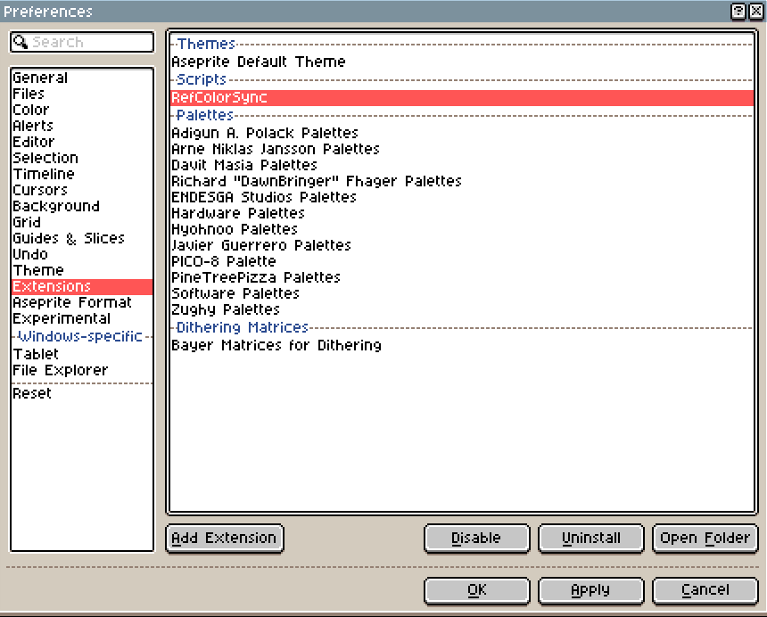
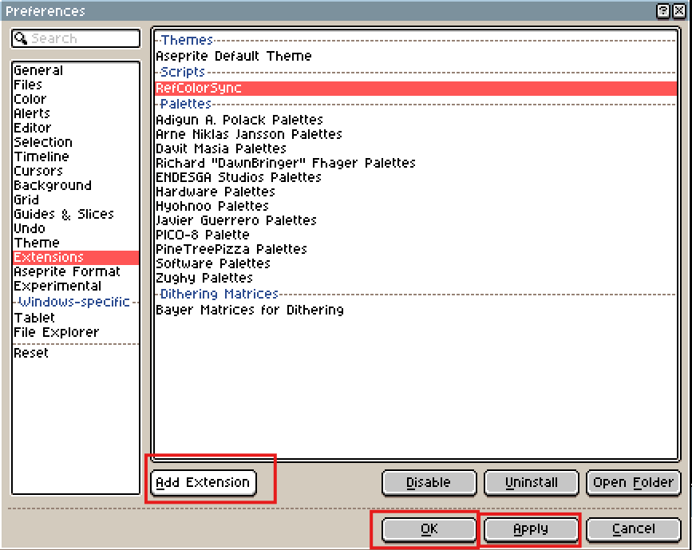

<div align="center">


# 🎨 RefColorSync

### Автоматическая синхронизация цвета с референс-слоя в Aseprite

Наведи курсор на референс — получи точный цвет переднего плана. Без пипетки, без пауз, без потери потока рисования.

[](https://www.aseprite.org/)
[](LICENSE)
[](#)
[](#)

[Возможности](#-возможности) •
[Установка](#-установка) •
[Быстрый старт](#-быстрый-старт) •
[Настройки](#-настройки) •
[Как это работает](#-как-это-работает) •
[FAQ](#-faq)

</div>

---

## 📌 О проекте

**RefColorSync** — расширение для [Aseprite](https://www.aseprite.org/), которое избавляет от рутины постоянного переключения на пипетку при рисовании поверх референсов.

Обычный воркфлоу пиксель-арта поверх референса выглядит так: посмотрел на референс → взял пипетку → кликнул → переключился на кисть → нарисовал. RefColorSync убирает средние шаги: цвет переднего плана обновляется **автоматически**, пока вы просто двигаете курсором по референс-слою.

> 💡 Идеально подходит для пиксель-арта по фотографиям, ресайза палитр, дитеринга вручную и любых задач, где важно постоянно «подсматривать» точный цвет с оригинала.

---

## ✨ Возможности

| | |
|---|---|
| 🎯 **Автосэмплинг цвета** | Цвет переднего плана обновляется в реальном времени по позиции курсора над референс-слоем |
| 🗂️ **Настраиваемый референс-слой** | Укажите имя любого слоя (в т.ч. вложенного в группу) — оттуда и будут браться цвета |
| 🖼️ **Режим композита** | Сэмплирование не с одного слоя, а с итогового видимого изображения всех слоёв |
| 👻 **Игнорирование прозрачности** | Прозрачные пиксели не сбрасывают текущий выбранный цвет |
| ⚡ **Регулируемая частота опроса** | От 15 до 40 обновлений в секунду — баланс между отзывчивостью и нагрузкой на CPU |
| 🎨 **Полная поддержка цветовых режимов** | RGB, Indexed и Grayscale обрабатываются корректно, включая палитру индексированного режима |
| 🧠 **Умное кэширование** | Повторный пиксель не пересчитывается, пока курсор не сдвинулся; полный композит перерисовывается не чаще 2 раз/сек |
| 💾 **Сохранение состояния** | Настройки и статус слежения сохраняются между сессиями Aseprite |

---

## 📦 Установка

### Способ 1 — через файл расширения (рекомендуется)

1. Скачайте `RefColorSync.aseprite-extension` из [Releases](../../releases) или соберите сами (см. [ниже](#️-разработка--сборка))
2. Дважды кликните по файлу — Aseprite предложит установить расширение автоматически
3. Перезапустите Aseprite, если будет запрошено

### Способ 2 — через настройки Aseprite

```
Edit → Preferences → Extensions → Add Extension → выберите .aseprite-extension файл
```

### Способ 3 — сборка из исходников

```bash
git clone https://github.com/<your-username>/RefColorSync.git
cd RefColorSync
zip -r RefColorSync.aseprite-extension . -x ".git/*"
```

Затем установите получившийся файл любым из способов выше.

---

## 🖱️ Пошаговая инструкция со скриншотами

Ниже — весь путь от установки до первого автообновления цвета, с картинками для каждого шага.

### Шаг 1. Откройте настройки Aseprite

`Edit` → `Preferences...` *(или горячая клавиша `Ctrl+K`)*

<div align="center">

</div>

### Шаг 2. Перейдите в раздел Extensions и установите расширение

Слева в списке разделов выберите **Extensions**. Расширение **RefColorSync** появится в списке `Scripts`, если уже установлено. Если ещё нет — нажмите **Add Extension** и выберите файл `RefColorSync.aseprite-extension`.

<div align="center">

</div>

### Шаг 3. Подтвердите установку

Нажмите **Add Extension**, выберите файл расширения в проводнике, затем нажмите **OK** (или **Apply**), чтобы применить изменения.

<div align="center">

</div>

> 🔴 На скриншоте красным выделены кнопка **Add Extension** (добавить файл расширения) и кнопка **OK** (подтвердить и закрыть окно настроек).

### Шаг 4. Назовите референс-слой

Дважды кликните по слою, с которого хотите сэмплировать цвет (или `Layer → Properties`), и назовите его так же, как указано в настройках расширения — по умолчанию `Reference`.

<div align="center">

</div>

### Шаг 5. Запустите слежение через меню View

Расширение добавляет пункт **Toggle RefColorSync** в меню `View`. Кликните по нему, чтобы включить/выключить автосэмплинг цвета.

<div align="center">

</div>

> 💡 Тот же пункт можно найти в `Edit → RefColorSync Settings...` — там же настраиваются частота опроса, имя референс-слоя и остальные параметры (см. таблицу [⚙️ Настройки](#️-настройки)).

После этого просто наведите курсор на референс-слой — цвет переднего плана обновится автоматически, можно сразу рисовать.

---

## 🚀 Быстрый старт

```
1. Откройте спрайт и создайте/импортируйте референс-слой (по умолчанию ищется слой "Reference")
2. Edit → RefColorSync Settings...
3. Нажмите "Enable Watching"
4. Наведите курсор на референс-слой — цвет переднего плана обновится автоматически
5. Рисуйте как обычно ✏️
```

<div align="center">

**Навёл курсор → цвет обновился → рисуешь.**
Никакой пипетки, никаких лишних кликов.

</div>

### Команды расширения

| Команда | Где находится | Что делает |
|---|---|---|
| **Toggle RefColorSync** | `Edit` → `RefColorSync Toggle` | Включает/выключает слежение одним кликом. Можно назначить горячую клавишу через `Edit → Keyboard Shortcuts` |
| **RefColorSync Settings...** | `Edit` → `RefColorSync Settings...` | Открывает окно настроек |

---

## ⚙️ Настройки

| Параметр | По умолчанию | Описание |
|---|:---:|---|
| **Reference Layer Name** | `Reference` | Имя слоя, с которого читается цвет. Поддерживаются слои внутри групп |
| **Update Frequency** | `25 Гц` | Частота опроса позиции курсора (15–40 Гц). Выше — плавнее, ниже — экономичнее по CPU |
| **Ignore Transparent Pixels** | `✅ Вкл.` | При наведении на прозрачный пиксель цвет переднего плана не меняется |
| **Sample from Composite** | `❌ Выкл.` | Брать цвет не с конкретного слоя, а с итогового видимого изображения (все слои вместе) |

Все настройки сохраняются в `plugin.preferences` и восстанавливаются при следующем запуске Aseprite — включая состояние «включено/выключено».

---

## 🔍 Как это работает

```
┌──────────────┐     позиция курсора      ┌─────────────┐
│    Timer      │ ───────────────────────▶ │   Sampler   │
│ (15–40 Гц)    │                          │             │
└──────────────┘                          └──────┬──────┘
                                                  │
                            читает 1 пиксель      │
                     с референс-слоя или композита│
                                                  ▼
                                          ┌───────────────┐
                                          │  app.fgColor  │
                                          │  обновляется  │
                                          └───────────────┘
```

1. **Watcher** запускает `Timer`, который с заданной частотой проверяет `app.editor.spritePos` — позицию курсора в координатах спрайта.
2. Если позиция изменилась, **Sampler** читает пиксель:
   - либо напрямую из `cel.image` референс-слоя (быстро, без рендера);
   - либо, в режиме композита, рендерит **только 1×1 пиксель** через `Image:drawSprite()` со смещением — вместо рендера всего кадра.
3. Пиксель конвертируется в `Color` с учётом цветового режима спрайта (RGB / Indexed / Grayscale), после чего `app.fgColor` обновляется.

### Оптимизации под капотом

- **Кэш позиции** — повторный сэмплинг не выполняется, если курсор не сдвинулся ни на пиксель
- **Точечный рендер вместо полного** — в режиме композита используется офсет-трюк рендера 1×1, а не перерисовка всего кадра
- **Fallback-кэш** — если точечный рендер недоступен, полный композит пересчитывается не чаще двух раз в секунду
- **Сброс кэша при смене спрайта** — переключение между открытыми документами не тянет за собой устаревшие данные

---

## ⚠️ Ограничения

Lua API Aseprite не предоставляет хук на «во время самого мазка кистью» — перехватить рисование пиксель-за-пикселем при зажатой кнопке мыши невозможно. Поэтому:

- Цвет обновляется **по позиции курсора**, а не в процессе самого мазка
- На практике это ощущается как задуманное поведение: навёл → цвет обновился → начал рисовать
- Индексированные тайлмап-слои (`Tilemap`) не поддерживаются как источник сэмплирования — тайлы хранят индексы, а не цвета

---

## 🖥️ Системные требования

- **Aseprite v1.3+** (используется API `app.editor`, добавленный в этой версии)
- ОС: Windows · macOS · Linux — без ограничений

---

## 🗺️ Планы на будущее

- [ ] Поддержка нескольких референс-слоёв с быстрым переключением между ними
- [ ] Визуальный индикатор текущего сэмплированного цвета рядом с курсором
- [ ] Радиус усреднения — сэмплинг среднего по N соседним пикселям (полезно для шумных фото-референсов)
- [ ] Горячая клавиша временного отключения без захода в настройки

Есть идея или нашли баг? Открывайте [Issue](../../issues) — предложения приветствуются 🙌

---

## 🗂️ Структура проекта

```
RefColorSync/
├── package.json          # манифест расширения
├── main.lua              # точка входа: регистрация команд
├── src/
│   ├── config.lua        # хранение и чтение настроек (plugin.preferences)
│   ├── sampler.lua       # чтение пикселя и конвертация в Color
│   ├── watcher.lua        # таймер, слежение за курсором, запуск/остановка
│   └── ui.lua             # диалоговое окно настроек
└── README.md
```

## 🛠️ Разработка / сборка

После внесения изменений в исходники пересоберите расширение:

```bash
zip -r RefColorSync.aseprite-extension . -x ".git/*" "*.md"
```

и переустановите его через `Edit → Preferences → Extensions`.

> 💬 При отладке удобно смотреть вывод в консоль Aseprite (`Help → Developer Tools` / вывод в терминал, если Aseprite запущен из консоли).

---

## ❓ FAQ

<details>
<summary><b>Расширение не находит референс-слой</b></summary>

Убедитесь, что имя слоя в настройках **точно** совпадает с именем слоя в спрайте (регистр важен). Если слой лежит внутри группы — это тоже поддерживается, искать не нужно вручную.
</details>

<details>
<summary><b>Цвет не обновляется в режиме композита</b></summary>

Проверьте, что курсор находится в границах холста — за пределами спрайта сэмплинг не выполняется. Также убедитесь, что нужные слои видимы (глазик включён).
</details>

<details>
<summary><b>Просадка FPS при высокой частоте обновления</b></summary>

Понизьте **Update Frequency** в настройках — 15–20 Гц обычно достаточно для комфортной работы и заметно снижает нагрузку.
</details>

<details>
<summary><b>Работает ли с индексированной палитрой?</b></summary>

Да, цвет читается напрямую из палитры спрайта (`sprite.palettes[1]`) по индексу пикселя.
</details>

---

## 📄 Лицензия

Проект распространяется под лицензией **MIT** — см. файл [`LICENSE`](LICENSE).

---

<div align="center">

Сделано для тех, кто рисует поверх референсов и устал жать <kbd>Alt</kbd> 🖌️

⭐ Если расширение оказалось полезным — поставьте звезду репозиторию!

</div>
